# Designing an Airline Management System

## Requirements
1. The airline management system should allow users to search for flights based on source, destination, and date.
2. Users should be able to book flights, select seats, and make payments.
3. The system should manage flight schedules, aircraft assignments, and crew assignments.
4. The system should handle passenger information, including personal details and baggage information.
5. The system should support different types of users, such as passengers, airline staff, and administrators.
6. The system should be able to handle cancellations, refunds, and flight changes.
7. The system should ensure data consistency and handle concurrent access to shared resources.
8. The system should be scalable and extensible to accommodate future enhancements and new features.

```mermaid
classDiagram
    class AirLine {
        SearchService searchService
        BookService bookService
        ClientRepository clientRepository
        FlightRepository flightRepository
    }
    class SearchService {
        Flight[] SearchFlights(FlightFilter)
    }
    class BookService {
        bool BookFlight(Client, seats[], IPayment)
    }
    class IPayment {
        <<interface>>
        bool Pay(Client, Amount)
    }
    class Client {
        int id
        string name
        string email
    }
    class ClientRepository {
        ConcurrentDict~int,Client~ clients
        Client CreateClient(name, email)
        bool RemoveClient(id)
        bool UpdateClient(id, name, email)
    }
    class FlightRepository {
        ConcurrentDict~int,Flight~ flights
        Client CreateFlight(airplane, source, destination, date, seats)
        bool RemoveFlight(id)
        bool UpdateFlight(id, airplane, source, destination, date, seats)
    }
    class AirPlaneRepository {
        ConcurrentDict~int,AirPlane~ airplanes
        Client CreateAirPlane()
        bool RemoveAirPlane(id)
    }
    class FlightFilter {
        string source
        string destination
        DateTime date
    }
    class AirPlane {
        int id
    }
    class Flight{
        int id
        AirPlane airplane
        string source
        string destination
        DateTime date
        Seat[] seats
    }
    class Seat {
        int id
        string description
    }
```

