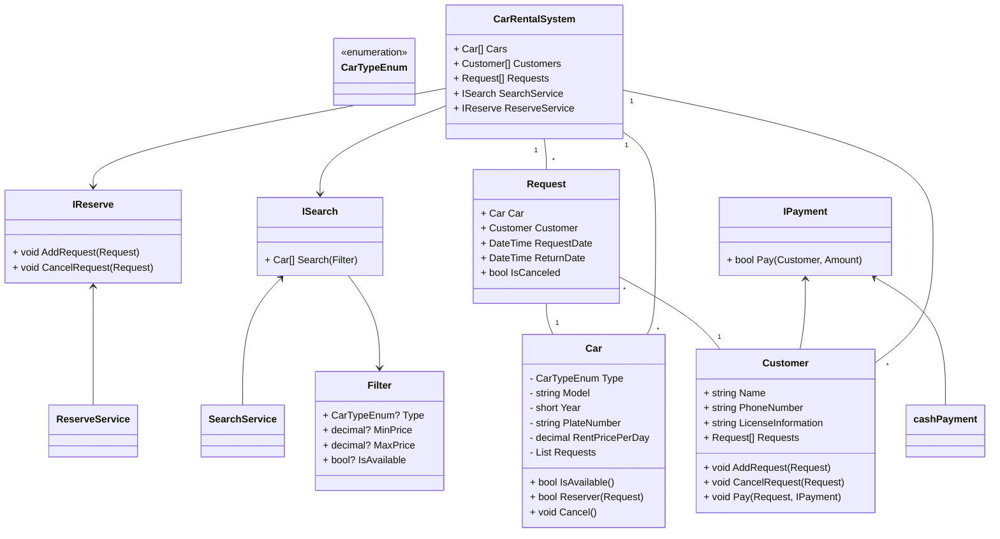

# Designing a Car Rental System

## Requirements
1. The car rental system should allow customers to browse and reserve available cars for specific dates.
2. Each car should have details such as make, model, year, license plate number, and rental price per day.
3. Customers should be able to search for cars based on various criteria, such as car type, price range, and availability.
4. The system should handle reservations, including creating, modifying, and canceling reservations.
5. The system should keep track of the availability of cars and update their status accordingly.
6. The system should handle customer information, including name, contact details, and driver's license information.
7. The system should handle payment processing for reservations.
8. The system should be able to handle concurrent reservations and ensure data consistency.

## Design

