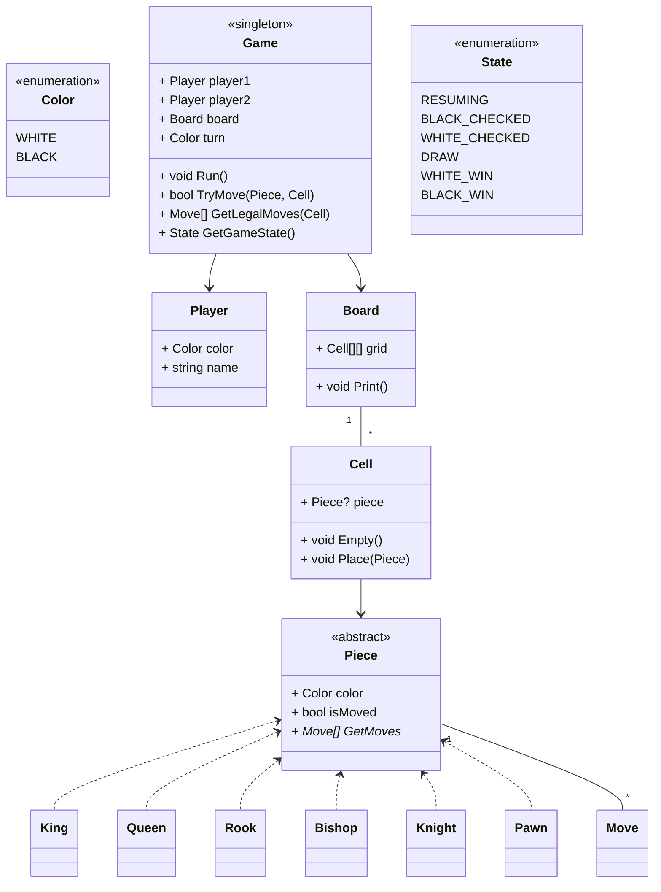

# Designing a Chess Game

## Requirements
1. The chess game should follow the standard rules of chess.
2. The game should support two players, each controlling their own set of pieces.
3. The game board should be represented as an 8x8 grid, with alternating black and white squares.
4. Each player should have 16 pieces: 1 king, 1 queen, 2 rooks, 2 bishops, 2 knights, and 8 pawns.
5. The game should validate legal moves for each piece and prevent illegal moves.
6. The game should detect checkmate and stalemate conditions.
7. The game should handle player turns and allow players to make moves alternately.
8. The game should provide a user interface for players to interact with the game.

## UML Diagram

