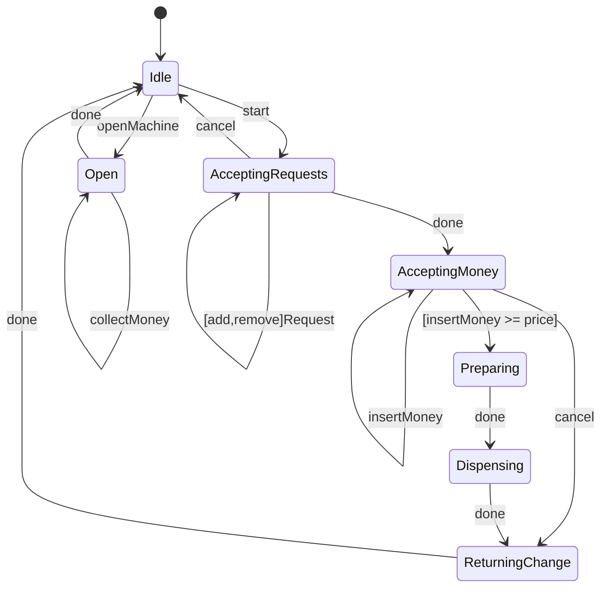
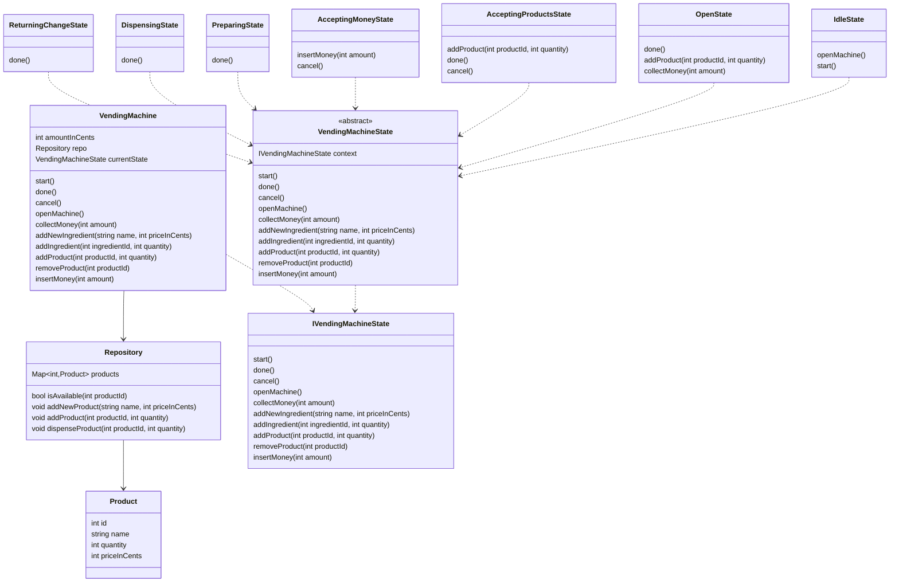

# Designing a Coffee Vending Machine

## Requirements
1. The coffee vending machine should support different types of coffee, such as espresso, cappuccino, and latte.
1. Each type of coffee should have a specific price and recipe (ingredients and their quantities).
1. The machine should have a menu to display the available coffee options and their prices.
1. Users should be able to select a coffee type and make a payment.
1. The machine should dispense the selected coffee and provide change if necessary.
1. The machine should track the inventory of ingredients and notify when they are running low.
1. The machine should handle multiple user requests concurrently and ensure thread safety.

