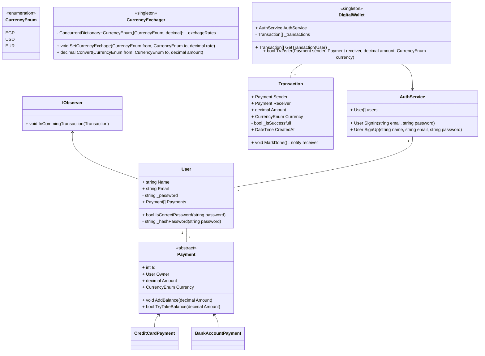

# Designing a Digital Wallet Service

## Requirements
1. The digital wallet should allow users to create an account and manage their personal information.
1. Users should be able to add and remove payment methods, such as credit cards or bank accounts.
1. The digital wallet should support fund transfers between users and to external accounts.
1. The system should handle transaction history and provide a statement of transactions.
1. The digital wallet should support multiple currencies and perform currency conversions.
1. The system should ensure the security of user information and transactions.
1. The digital wallet should handle concurrent transactions and ensure data consistency.
1. The system should be scalable to handle a large number of users and transactions.

## Design

