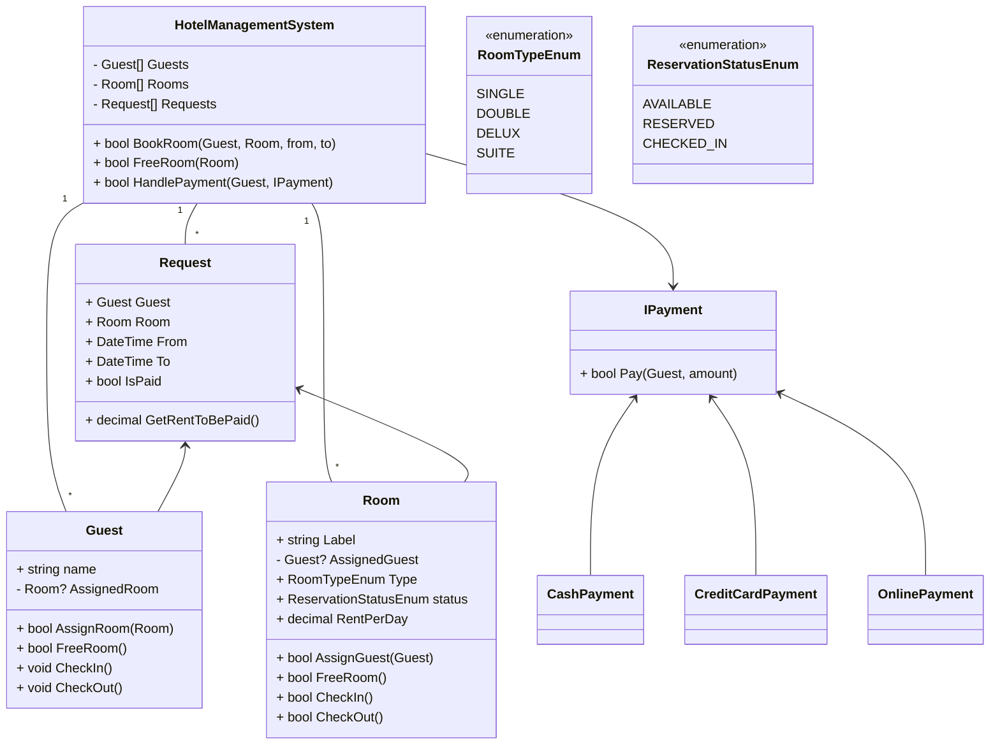

# Designing a Hotel Management System

## Requirements
1. The hotel management system should allow guests to book rooms, check-in, and check-out.
2. The system should manage different types of rooms, such as single, double, deluxe, and suite.
3. The system should handle room availability and reservation status.
4. The system should allow the hotel staff to manage guest information, room assignments, and billing.
5. The system should support multiple payment methods, such as cash, credit card, and online payment.
6. The system should handle concurrent bookings and ensure data consistency.
7. The system should provide reporting and analytics features for hotel management.
8. The system should be scalable and handle a large number of rooms and guests.

## Design

