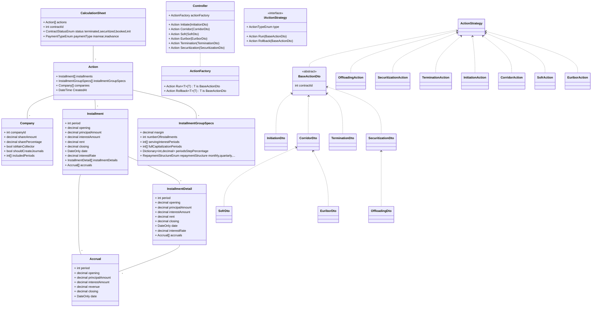

```mermaid
classDiagram
    class Controller {
        + ActionFactory actionFactory
        + Action Initiate(InitiationDto)
        + Action Corridor(CorridorDto)
        + Action Sofr(SofrDto)
        + Action Euribor(EuriborDto)
        + Action Termination(TerminationDto)
        + Action Securitization(SecuritizationDto)
    }
    class BaseActionDto {
        <<abstract>>
        int contractId
    }
    class CalculationSheet {
        + Action[] actions
        + int contractId
        + ContractStatusEnum status terminated,securitized,booked,init
        + PaymentTypeEnum paymentType inarrear,inadvance
    }
    class Action {
        + Installment[] installments
        + InstallmentGroupSpecs[] installmentGroupSpecs
        + Company[] companies
        + DateTime CreatedAt
    }
    class InstallmentGroupSpecs{
        + decimal margin
        + int numberOfInstallments
        + int[] servingInterestPeriods 
        + int[] fullCapitalizationPeriods 
        + Dictionary~int,decimal~ periodsStepPercentage
        + RepaymentStructureEnum repaymentStructure monthly,quartarly,...
    }
    class Company {
        + int companyId
        + decimal shareAmount
        + decimal sharePercentage
        + bool isMainCollector
        + bool shouldCreateJournals
        + int[] includedPeriods
    }
    class Installment {
        + int period
        + decimal opening
        + decimal principalAmount
        + decimal interestAmount
        + decimal rent
        + decimal closing
        + DateOnly date
        + decimal interestRate
        + InstallmentDetail[] installmentDetails
        + Accrual[] accruals
    }
    class InstallmentDetail {
        + int period
        + decimal opening
        + decimal principalAmount
        + decimal interestAmount
        + decimal rent
        + decimal closing
        + DateOnly date
        + decimal interestRate
        + Accrual[] accruals
    }
    class Accrual {
        + int period
        + decimal opening
        + decimal principalAmount
        + decimal interestAmount
        + decimal revenue
        + decimal closing
        + DateOnly date
    }
    class IActionStrategy {
        <<interface>>
        + ActionTypeEnum type
        + Action Run(BaseActionDto)
        + Action Rollback(BaseActionDto)
    }
    class ActionFactory {
        + Action Run~T~(T) T is BaseActionDto
        + Action Rollback~T~(T) T is BaseActionDto
    }
    Controller .. ActionFactory
    BaseActionDto <.. InitiationDto 
    BaseActionDto <.. CorridorDto 
    CorridorDto <.. SofrDto 
    CorridorDto <.. EuriborDto 
    BaseActionDto <.. TerminationDto 
    BaseActionDto <.. SecuritizationDto 
    SecuritizationDto <.. OffloadingDto 
    CalculationSheet -- "*" Action
    ActionStrategy .. BaseActionDto
    ActionStrategy <.. OffloadingAction
    ActionStrategy <.. SecuritizationAction
    ActionStrategy <.. TerminationAction
    ActionStrategy <.. InitiationAction
    ActionStrategy <.. CorridorAction
    ActionStrategy <.. SofrAction
    ActionStrategy <.. EuriborAction
    Action -- "*" Company
    Action -- "*" Installment
    Action -- "*" InstallmentGroupSpecs
    Installment -- "*" Accrual
    InstallmentDetail -- "*" Accrual
    Installment -- "*" InstallmentDetail
```

