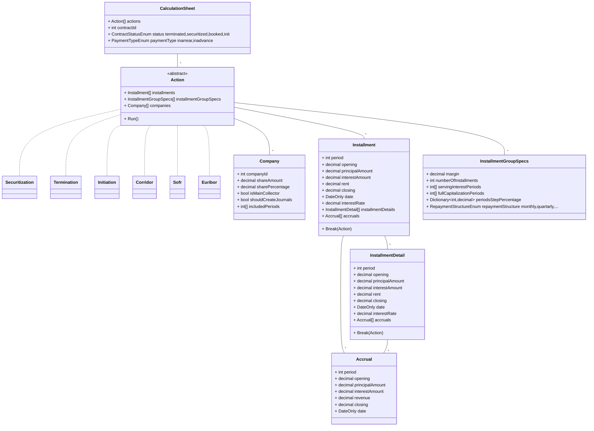

```mermaid
classDiagram
    class CalculationSheet {
        + Action[] actions
        + int contractId
        + ContractStatusEnum status terminated,securitized,booked,init
        + PaymentTypeEnum paymentType inarrear,inadvance
    }
    CalculationSheet -- "*" Action
    class Action {
        <<abstract>>
        + Installment[] installments
        + InstallmentGroupSpecs[] installmentGroupSpecs
        + Company[] companies
        + Run()
    }
    Action .. Securitization
    Action .. Termination
    Action .. Initiation
    Action .. Corridor
    Action .. Sofr
    Action .. Euribor
    Action -- "*" Company
    Action -- "*" Installment
    Action -- "*" InstallmentGroupSpecs
    class InstallmentGroupSpecs{
        + decimal margin
        + int numberOfInstallments
        + int[] servingInterestPeriods 
        + int[] fullCapitalizationPeriods 
        + Dictionary~int,decimal~ periodsStepPercentage
        + RepaymentStructureEnum repaymentStructure monthly,quartarly,...
    }
    class Company {
        + int companyId
        + decimal shareAmount
        + decimal sharePercentage
        + bool isMainCollector
        + bool shouldCreateJournals
        + int[] includedPeriods
    }
    class Installment {
        + int period
        + decimal opening
        + decimal principalAmount
        + decimal interestAmount
        + decimal rent
        + decimal closing
        + DateOnly date
        + decimal interestRate
        + InstallmentDetail[] installmentDetails
        + Accrual[] accruals
        + Break(Action)
    }
    Installment -- "*" InstallmentDetail
    class InstallmentDetail {
        + int period
        + decimal opening
        + decimal principalAmount
        + decimal interestAmount
        + decimal rent
        + decimal closing
        + DateOnly date
        + decimal interestRate
        + Accrual[] accruals
        + Break(Action)
    }
    Installment -- "*" Accrual
    InstallmentDetail -- "*" Accrual
    class Accrual {
        + int period
        + decimal opening
        + decimal principalAmount
        + decimal interestAmount
        + decimal revenue
        + decimal closing
        + DateOnly date
    }
```

