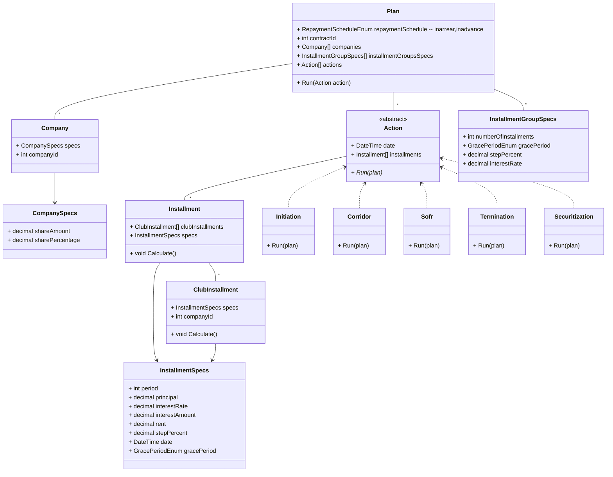

```mermaid
classDiagram
    class Plan {
        + RepaymentScheduleEnum repaymentSchedule -- inarrear,inadvance
        + int contractId
        + Company[] companies
        + InstallmentGroupSpecs[] installmentGroupsSpecs
        + Action[] actions
        + Run(Action action)
    }
    Plan -- "*" Action
    Plan -- "*" Company
    Plan -- "*" InstallmentGroupSpecs
    Company --> CompanySpecs
    Action -- "*" Installment
    Installment -- "*" ClubInstallment
    Installment --> InstallmentSpecs
    ClubInstallment --> InstallmentSpecs
    class Action {
        <<abstract>>
        + DateTime date
        + Installment[] installments
        + Run(plan)*
    }
    class Initiation {
        + Run(plan)
    }
    class Corridor {
        + Run(plan)
    }
    class Sofr {
        + Run(plan)
    }
    class Termination {
        + Run(plan)
    }
    class Securitization {
        + Run(plan)
    }
    Action <.. Initiation
    Action <.. Corridor
    Action <.. Sofr
    Action <.. Termination
    Action <.. Securitization
    class InstallmentSpecs {
        + int period
        + decimal principal
        + decimal interestRate
        + decimal interestAmount
        + decimal rent
        + decimal stepPercent
        + DateTime date
        + GracePeriodEnum gracePeriod
    }
    class CompanySpecs {
        + decimal shareAmount
        + decimal sharePercentage
    }
    class InstallmentGroupSpecs {
        + int numberOfInstallments
        + GracePeriodEnum gracePeriod
        + decimal stepPercent
        + decimal interestRate
    }
    class Installment {
        + ClubInstallment[] clubInstallments
        + InstallmentSpecs specs
        + void Calculate()
    }
    class ClubInstallment {
        + InstallmentSpecs specs
        + int companyId
        + void Calculate()
    }
    class Company {
        + CompanySpecs specs
        + int companyId
    }
```

