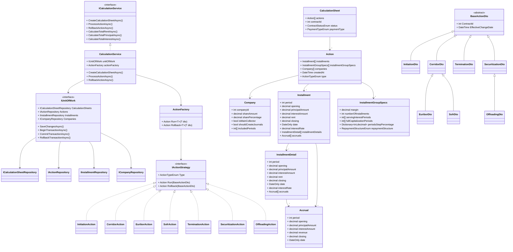

# Installment Planner

A financial calculation system for managing installment plans with support for various action types, calculations, and data persistence through a Unit of Work pattern.

## Architecture Overview

The system follows a layered architecture with clear separation of concerns:

### Core Layers

1. **Models** - Domain entities representing financial data
2. **DTOs** - Data Transfer Objects for service communication
3. **Strategies** - Business logic implementations for different action types
4. **Repositories** - Data access abstraction layer
5. **Unit of Work** - Transaction and repository coordination
6. **Services** - Business logic and calculation services
7. **Factories** - Object creation and strategy selection

## Key Components

### Models (`/Models`)
- **CalculationSheet** - Main entity containing actions, contract information, and status
- **Action** - Represents financial actions with installments, companies, and specifications
- **Installment** - Individual payment periods with financial details
- **InstallmentDetail** - Detailed breakdown of installment components
- **Company** - Company participation in financial arrangements
- **Accrual** - Revenue and interest accrual tracking
- **InstallmentGroupSpecs** - Specifications for installment groupings and structures

### Strategy Pattern (`/Strategies`)
Implements different types of financial actions:
- **InitiationAction** - Contract initiation
- **CorridorAction** - Interest rate corridor adjustments
- **EuriborAction** - EURIBOR rate-based calculations
- **SofrAction** - SOFR rate-based calculations
- **TerminationAction** - Contract termination
- **SecuritizationAction** - Asset securitization
- **OffloadingAction** - Asset offloading

### Data Transfer Objects (`/DTOs`)
- **BaseActionDto** - Abstract base for all action DTOs
- Specific DTOs for each action type with inheritance hierarchy:
  - `CorridorDto` ← `EuriborDto`, `SofrDto`
  - `SecuritizationDto` ← `OffloadingDto`
  - `InitiationDto`, `TerminationDto` extend `BaseActionDto`

### Repository Pattern (`/Repositories`)
- **IRepository<T>** - Generic repository interface
- **Specific repositories** for each entity type:
  - `ICalculationSheetRepository`
  - `IActionRepository`
  - `IInstallmentRepository`
  - `ICompanyRepository`
- **In-memory implementations** for all repositories

### Unit of Work (`/UnitOfWork`)
- **IUnitOfWork** - Coordinates repositories and transactions
- **InMemoryUnitOfWork** - Implementation with transaction support
- Provides centralized data access and ensures consistency

### Services (`/Services`)
- **ICalculationService** - Main business logic interface
- **CalculationService** - Implementation providing:
  - Calculation sheet management
  - Action processing and rollback
  - Financial calculations (totals, period-based queries)
  - Transaction management

### Factory Pattern (`/Factories`)
- **ActionFactory** - Routes DTOs to appropriate strategy implementations
- Uses pattern matching for type-safe strategy selection
- Supports both execution and rollback operations

## Enums (`/Enums`)
- **ActionTypeEnum** - Types of financial actions
- **ContractStatusEnum** - Contract status flags (Init, Booked, Terminated, Securitized)
- **PaymentTypeEnum** - Payment timing (InArrear, InAdvance)
- **RepaymentStructureEnum** - Repayment frequency and structure

## Configuration (`/Configuration`)
- **ServiceConfiguration** - Dependency injection setup
- Registers all services, repositories, and strategies

## Usage Example

```csharp
// Setup dependency injection
var services = new ServiceCollection();
services.AddInstallmentPlannerServices();
var serviceProvider = services.BuildServiceProvider();

// Get the calculation service
var calculationService = serviceProvider.GetRequiredService<ICalculationService>();

// Create a calculation sheet
var calculationSheet = await calculationService.CreateCalculationSheetAsync(
    contractId: 12345, 
    PaymentTypeEnum.InArrear);

// Process an action
var initiationDto = new InitiationDto { ContractId = 12345 };
await calculationService.ProcessActionAsync(12345, initiationDto);

// Calculate financial totals
var totalRent = await calculationService.CalculateTotalRentAsync(12345);
var totalPrincipal = await calculationService.CalculateTotalPrincipalAsync(12345);
var totalInterest = await calculationService.CalculateTotalInterestAsync(12345);
```

## Architecture Diagram



## Design Patterns Used

- **Strategy Pattern** - Different action implementations
- **Factory Pattern** - Action strategy creation and routing
- **Repository Pattern** - Data access abstraction
- **Unit of Work Pattern** - Transaction coordination
- **Dependency Injection** - Loose coupling and testability

## Technology Stack

- **.NET 9.0** - Framework
- **C# 12** - Language features (primary constructors, pattern matching)
- **Microsoft.Extensions.DependencyInjection** - IoC container
- **Microsoft.Extensions.Hosting** - Application hosting

## Future Enhancements

- Database integration (replace in-memory repositories)
- Entity Framework Core support
- API controllers for REST endpoints
- Validation middleware
- Logging and monitoring
- Unit and integration tests

