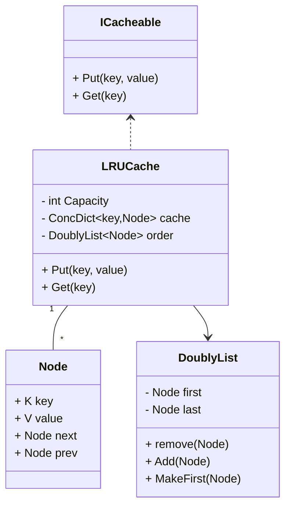

# Designing a LRU Cache

## Requirements
1. The LRU cache should support the following operations:
- put(key, value): Insert a key-value pair into the cache. If the cache is at capacity, remove the least recently used item before inserting the new item.
- get(key): Get the value associated with the given key. If the key exists in the cache, move it to the front of the cache (most recently used) and return its value. If the key does not exist, return -1.
2. The cache should have a fixed capacity, specified during initialization.
3. The cache should be thread-safe, allowing concurrent access from multiple threads.
4. The cache should be efficient in terms of time complexity for both put and get operations, ideally O(1).

