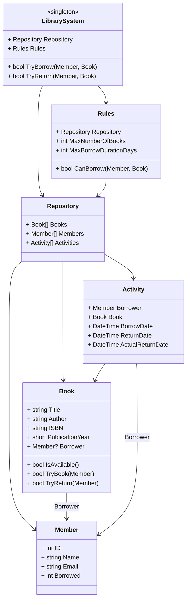

# Designing a Library Management System

## Requirements
1. The library management system should allow librarians to manage books, members, and borrowing activities.
2. The system should support adding, updating, and removing books from the library catalog.
3. Each book should have details such as title, author, ISBN, publication year, and availability status.
4. The system should allow members to borrow and return books.
5. Each member should have details such as name, member ID, contact information, and borrowing history.
6. The system should enforce borrowing rules, such as a maximum number of books that can be borrowed at a time and loan duration.
7. The system should handle concurrent access to the library catalog and member records.
8. The system should be extensible to accommodate future enhancements and new features.

## Design

