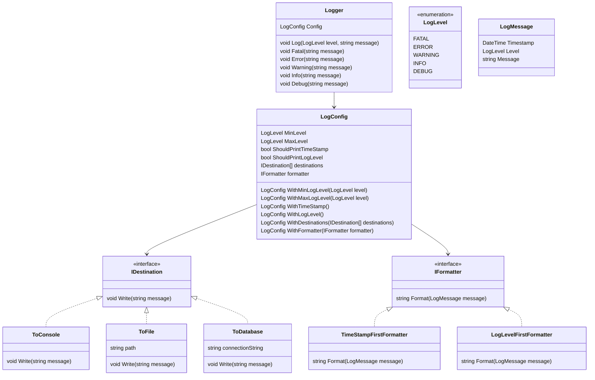

# Designing a Logging Framework

## Requirements
1. The logging framework should support different log levels, such as DEBUG, INFO, WARNING, ERROR, and FATAL.
2. It should allow logging messages with a timestamp, log level, and message content.
3. The framework should support multiple output destinations, such as console, file, and database.
4. It should provide a configuration mechanism to set the log level and output destination.
5. The logging framework should be thread-safe to handle concurrent logging from multiple threads.
6. It should be extensible to accommodate new log levels and output destinations in the future.

