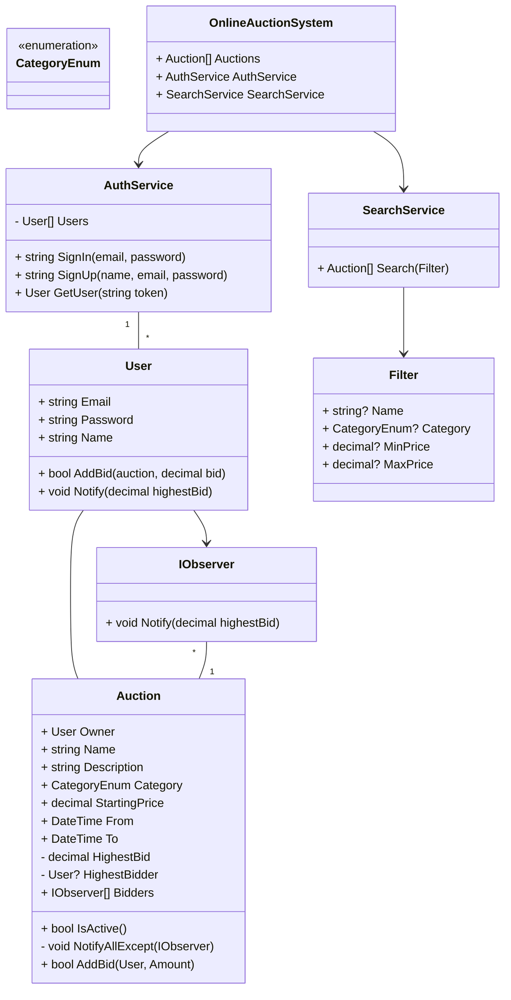

## Requirements
1. The online auction system should allow users to register and log in to their accounts.
2. Users should be able to create new auction listings with details such as item name, description, starting price, and auction duration.
3. Users should be able to browse and search for auction listings based on various criteria (e.g., item name, category, price range).
4. Users should be able to place bids on active auction listings.
5. The system should automatically update the current highest bid and notify the bidders accordingly.
6. The auction should end when the specified duration is reached, and the highest bidder should be declared the winner.
7. The system should handle concurrent access to auction listings and ensure data consistency.
8. The system should be extensible to accommodate future enhancements and new features.

## Design

