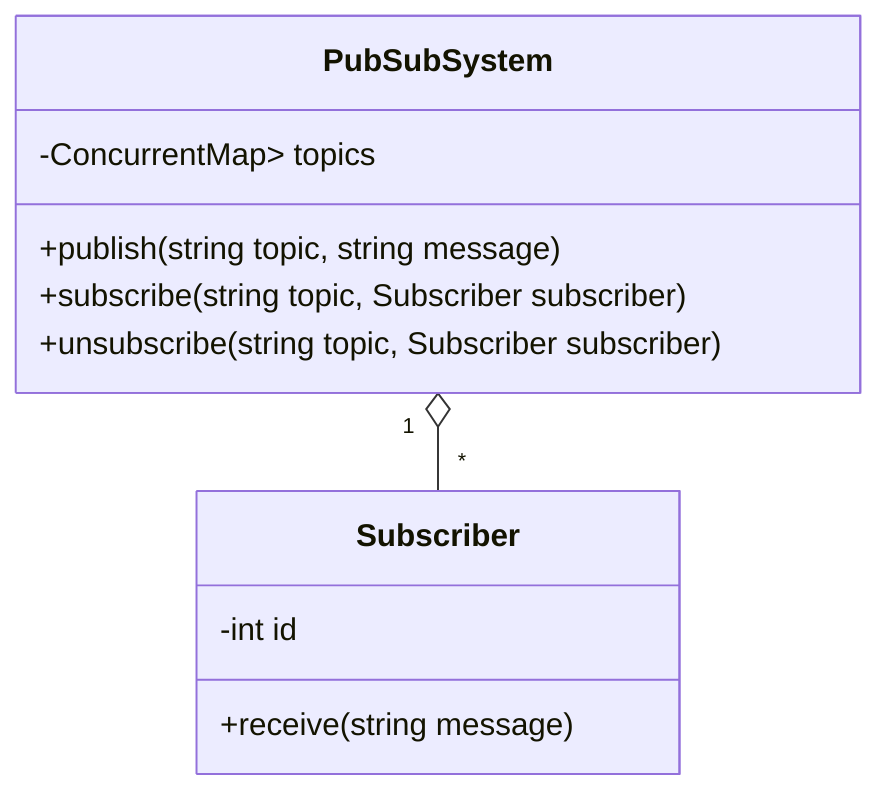

# Designing a Pub-Sub System

## Requirements
1. The Pub-Sub system should allow publishers to publish messages to specific topics.
1. Subscribers should be able to subscribe to topics of interest and receive messages published to those topics.
1. The system should support multiple publishers and subscribers.
1. Messages should be delivered to all subscribers of a topic in real-time.
1. The system should handle concurrent access and ensure thread safety.
1. The Pub-Sub system should be scalable and efficient in terms of message delivery.

## Design

