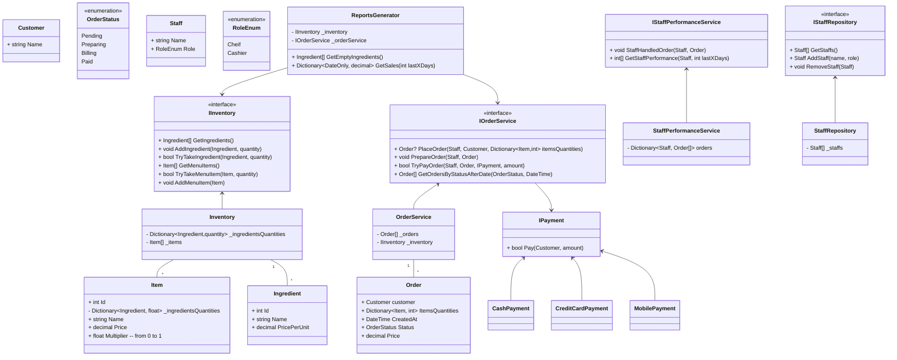

# Designing Restaurant Management System

## Requirements
1. The restaurant management system should allow customers to place orders, view the menu, and make reservations.
1. The system should manage the restaurant's inventory, including ingredients and menu items.
1. The system should handle order processing, including order preparation, billing, and payment.
1. The system should support multiple payment methods, such as cash, credit card, and mobile payments.
1. The system should manage staff information, including roles, schedules, and performance tracking.
1. The system should generate reports and analytics for management, such as sales reports and inventory analysis.
1. The system should handle concurrent access and ensure data consistency.

## Design

