# Designing a Social Network Like Facebook

## Requirements
#### User Registration and Authentication:
- Users should be able to create an account with their personal information, such as name, email, and password.
- Users should be able to log in and log out of their accounts securely.
#### User Profiles:
- Each user should have a profile with their information, such as profile picture, bio, and interests.
- Users should be able to update their profile information.
#### Friend Connections:
- Users should be able to send friend requests to other users.
- Users should be able to accept or decline friend requests.
- Users should be able to view their list of friends.
#### Posts and Newsfeed:
- Users should be able to create posts with text, images, or videos.
- Users should be able to view a newsfeed consisting of posts from their friends and their own posts.
- The newsfeed should be sorted in reverse chronological order.
#### Likes and Comments:
- Users should be able to like and comment on posts.
- Users should be able to view the list of likes and comments on a post.
#### Privacy and Security:
- Users should be able to control the visibility of their posts and profile information.
- The system should enforce secure access control to ensure data privacy.
#### Notifications:
- Users should receive notifications for events such as friend requests, likes, comments, and mentions.
- Notifications should be delivered in real-time.
#### Scalability and Performance:
- The system should be designed to handle a large number of concurrent users and high traffic load.
- The system should be scalable and efficient in terms of resource utilization.

## Design

```mermaid
classDiagram
    class User {
        + string Name
        + string Email
        + string? ProfilePicture
        + string? Bio
        + string? Interests
        - string _password
        - bool IsVisible
        + bool IsCorrectPassword(password)
        + void Notify(string notification)
    }
    class UsersRepository {
        - ConcurrentDictionary~string,User~ _users  -> string is email
        + User AddUser(string name, string email, string password)
        + void RemoveUser(string email)
        + User? GetUserByEmail(string email)
    }
    class INotify {
        + void Notify(string notification)
    }
    class AuthService {
        - UsersRepository _repo
        - ConcurrentDictionary~User,string~ _authedUsers -> string is token
        + Guid? SignUp (string name, string email, string password)
        + Guid? SignIn (string email, string password)
        + void SignOut (string email)
        + User? GetSignedUser(Guid token)
    }
    class UserService {
        - UsersRepository _repo 
        - AuthService _auth 
        + bool UpdateUserProfile(Guid token, profilePicture?, bio?, interests?)
        + void UpdateUserVisiblity(Guid token, bool)
        + User[] SearchUsers(string emailPrefix)
    }
    class ConnectionService {
        - User[] Friends -- todo
        - ConcurrentDictionary~int,FriendRequest~ Requests -- todo
        - UsersRepository _repo 
        - AuthService _auth 
        + bool SendFriendRequest(Guid token, string friendEmail)
        + bool AcceptFriendRequest(Guid token, int requestId)
        + bool DeclienFriendRequest(Guid token, int requestId)
    }
    class PostsService {
        - post[] posts --todo
        - UsersRepository _repo
        - AuthService _auth
        + Post[] GetPosts(Guid token) --> order by created time desc
        + Post CreatePost(Guid token, string? text, string[] imagesUrl, string[] videosUrl) --> handle mentions
        + bool AddLike(Guid token, int postId)
        + bool RemoveLike(Guid token, int postId)
        + bool AddComment(Guid token, int postId) --> handle mentions
    }
    class FriendRequest {
        + int Id
        + User From
        + User To
        + DateTime CreatedAt
    }
    class Post {
        + int Id
        + User Owner
        + string? Text
        + string[] ImagesUrl
        + string[] VideosUrl
        + Comment[] Comments
        + Like[] Likes
    }
    class Comment {
        + int Id
        + User Owner
        + string text
        + DateTime CreatedAt
    }
    class Like {
        + int Id
        + User Owner
        + DateTime CreatedAt
    }
```

