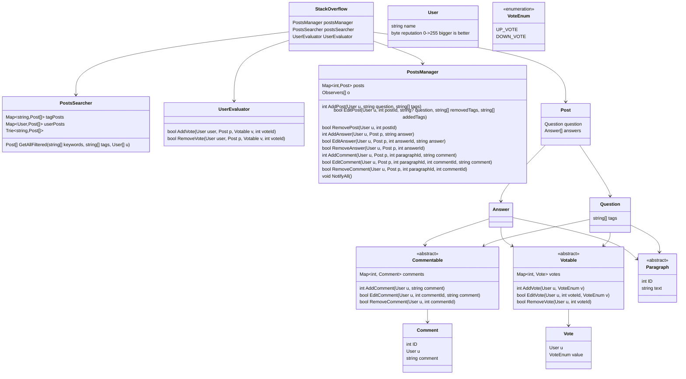

# Designing Stack Overflow

## Requirements
1. Users can post questions, answer questions, and comment on questions and answers.
2. Users can vote on questions and answers.
3. Questions should have tags associated with them.
4. Users can search for questions based on keywords, tags, or user profiles.
5. The system should assign reputation score to us based on their activity and the quality of their contributions.
6. The system should handle concurrent access and ensure data consistency.

## Exit Gate Sequence Diagram

