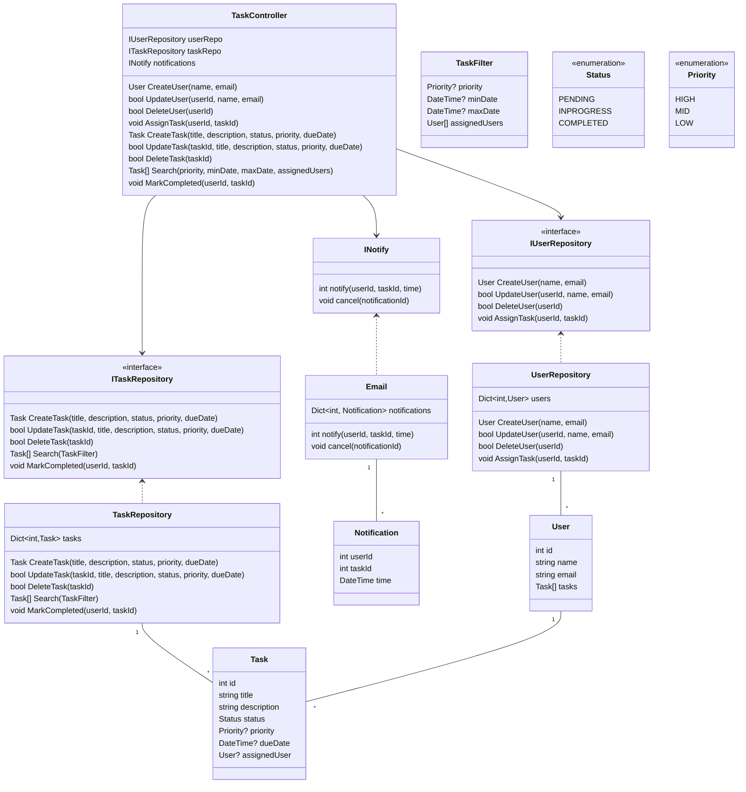

# Designing a Task Management System

## Requirements
1. The task management system should allow users to create, update, and delete tasks.
2. Each task should have a title, description, due date, priority, and status (e.g., pending, in progress, completed).
3. Users should be able to assign tasks to other users and set reminders for tasks.
4. The system should support searching and filtering tasks based on various criteria (e.g., priority, due date, assigned user).
5. Users should be able to mark tasks as completed and view their task history.
6. The system should handle concurrent access to tasks and ensure data consistency.
7. The system should be extensible to accommodate future enhancements and new features.

