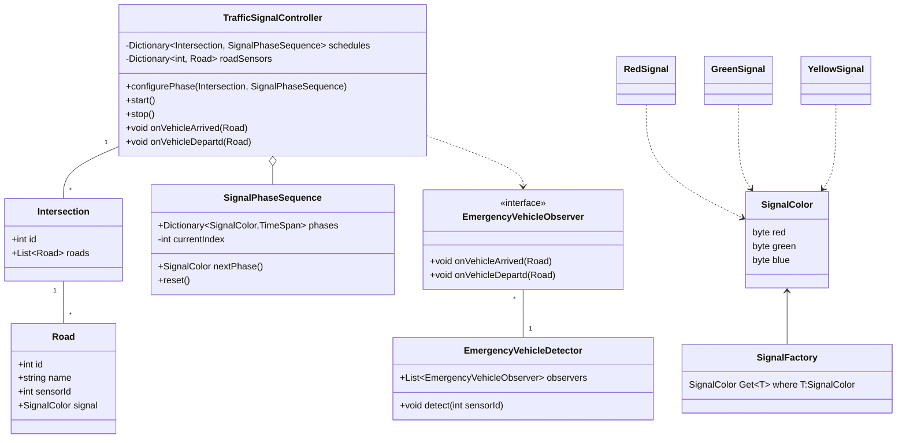

# Designing a Traffic Signal Control System

## Requirements
1. The traffic signal system should control the flow of traffic at an intersection with multiple roads.
2. The system should support different types of signals, such as red, yellow, and green.
3. The duration of each signal should be configurable and adjustable based on traffic conditions.
4. The system should handle the transition between signals smoothly, ensuring safe and efficient traffic flow.
5. The system should be able to detect and handle emergency situations, such as an ambulance or fire truck approaching the intersection.
6. The system should be scalable and extensible to support additional features and functionality.

